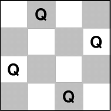

# NUCS

## Why Python ?
NUCS is a 100% Python library leveraging Numpy and Numba.

### Python
Python is a powerful and flexible programing language that allows to express complex problems in a few lines of code.

### Numpy
Numpy brings the computational power of languages like C and Fortran to Python, a language much easier to learn and use. 

### Numba
Numba translates Python functions to optimized machine code at runtime using the industry-standard LLVM compiler library. 
Numba-compiled numerical algorithms in Python can approach the speeds of C or FORTRAN.

## Architecture
NUCS leverages Numpy arrays (`numpy.ndarray`) for storing most of its data.

### Variables
Variables are simply integers used to reference domains. 

> In NUCS, variables are not reified but are implicit.

Let's consider three variables with integer domains **[1, 10]**.

| Variable index | Domain      |
|----------------|-------------|
| **0**          | **[1, 10]** | 
| **1**          | **[1, 10]** |
| **2**          | **[1, 10]** |

NUCS could represent these domains as a `numpy.ndarray` of shape `(3,2)`: 
- one row for each domain
- the first column corresponds to the minimal values
- the second column corresponds to the maximal values

> The reality is a bit more complex, as explained below.

### Domains
#### Shared domains
Let's consider two variables with initial domains **[1, 10]** and the constraint **v_0 = v_1 + 4**.
Because of bound consistency, the domain of **v_0** is **[5, 10]** and the domain of **v_1** is **[1, 6]**.

There is a lot of overhead here: 
- each time we update the domain of **v_0**, we also need to update the domain of **v_1** (and vice versa)
- from the point of view of the variable choice heuristic, 
the problem is made arbitrarily large and it makes no difference whether **v_0** or **v_1** is selected
- from the point of view of the backtracking mechanism, there are two variables to store and restore

We can efficiently replace both domains by a single shared domain and two offsets **4** and **0**:

| Variable index | Offset | Shared domain index |
|----------------|--------|---------------------|
| **0**          | **4**  | **0**               | 
| **1**          | **0**  | **0**               |

With:

| Shared domain index | Shared domain |
|---------------------|---------------|
| **0**               | **[1, 6]**    |

> In NUCS, actual domains are computed on demand from shared domains and offsets.

##### The constructor of the `Problem` class
Because of shared domains and offsets, the constructor of `Problem` accepts 3 arguments:
- the shared domains as a list of pairs of integers (if the minimal and maximal values of the pair are equal, the pair can be replaced by the value)
- a list of integers representing, for each variable, the index of its shared domain 
- a list of integers representing, for each variable, the offset of its shared domain

Python, with the help of lists and ranges, makes the construction of complex problems an easy task.
Internally, for greater efficiency, shared domains, domain indices and offsets are stored using `numpy.ndarray`.

##### A concrete example: the 4-queens problem


The 4-queens problem can be modelled as follows:
- for **i** in **[0, 3]**, **v_i** is the vertical position of the queen in the **i**th column
- **v_0, v_1, v_2, v_3** are all different
- **v_0, v_1 + 1, v_2 + 2, v_3 + 3** are all different
- **v_0, v_1 - 1, v_2 - 2, v_3 - 3** are all different

This corresponds to the 12 variables **v_i** with the following relations, for **i** in **[0, 3]**:
- **v_{i+4} = v_i + i**
- **v_{i+8} = v_i - i**
- all the **v_i** are different
- all the **v_{i+4}** are different
- all the **v_{i+8}** are different

The domains of these variables can thus be represented as follows:

| Variable index | Offset | Shared domain index |
|----------------|--------|---------------------|
| **0**          | **0**  | **0**               | 
| **1**          | **0**  | **1**               |
| **0**          | **0**  | **2**               | 
| **1**          | **0**  | **3**               |
| **0**          | **0**  | **0**               | 
| **1**          | **1**  | **1**               |
| **0**          | **2**  | **2**               | 
| **1**          | **3**  | **3**               |
| **0**          | **0**  | **0**               | 
| **1**          | **-1** | **1**               |
| **0**          | **-2** | **2**               | 
| **1**          | **-3** | **3**               |

With:

| Shared domain index | Shared domain |
|---------------------|---------------|
| **0**               | **[0, 3]**    | 
| **1**               | **[0, 3]**    | 
| **2**               | **[0, 3]**    | 
| **3**               | **[0, 3]**    | 


In NUCS, the n-queens problem is indeed constructed as follows:
```python
def __init__(self, n: int):
    super().__init__(
        [(0, n - 1)] * n,
        list(range(n)) * 3,
        [0] * n + list(range(n)) + list(range(0, -n, -1)),
    )
    self.add_propagator((list(range(n)), ALG_ALLDIFFERENT, []))
    self.add_propagator((list(range(n, 2 * n)), ALG_ALLDIFFERENT, []))
    self.add_propagator((list(range(2 * n, 3 * n)), ALG_ALLDIFFERENT, []))
```

#### Integer domains
NUCS only support integer domains.

#### Boolean domains
Boolean domains are simply integer domains of the form **[0, 1]**.

### Consistency
The `filter` method of the problem is responsible for bound consistency computation.

#### Propagators (aka constraints)
Each propagator `XXX` defines two functions:
- `compute_domains_XXX(domains: NDArray, data: NDArray) -> int`
- `get_triggers_XXX(size: int, data: NDArray) -> NDArray`

##### `compute_domains`
This function takes as its first argument the actual domains (not the shared ones) of the variables of the propagator 
and updates them. 

It is expected to implement bound consistency and to be idempotent 
(a second consecutive run should not update the domains).

It returns a status:
- `PROP_INCONSISTENCY`, 
- `PROP_CONSISTENCY` or 
- `PROP_ENTAILMENT`.

##### `get_triggers`
This function returns a `numpy.ndarray` of shape `(size, 2)`. 

Let `triggers` be such an array, 
`triggers[i, MIN] == True` means that the propagator should be triggered whenever the minimum value of variable `ì` changes.

## Reference documentation
### Limits
Domains limits are 32-bits integers.
The number of variables is an unsigned 16-bits integer.

### Propagators
NUCS currently provides the following propagators:
- `affine_eq_propagator`
- `affine_geq_propagator`
- `affine_leq_propagator`
- `alldifferent_propagator`
- `count_eq_propagator`
- `element_lic_propagator`
- `element_liv_propagator`
- `exactly_eq_propagator`
- `lexicographic_leq_propagator`
- `max_eq_propagator`
- `max_leq_propagator`
- `min_eq_propagator`
- `min_geq_propagator`
- `relation_propagator`

### Heuristics
#### Functions for selecting a variable
- `first_not_instantiated_var_heuristic`: selects the first non instantiated variable
- `last_not_instantiated_var_heuristic`: selects the last non instantiated variable
- `smallest_domain_var_heuristic`: selects the variable with the smallest domain which is not instantiated
- `greatest_domain_var_heuristic`: selects the variable with the greatest domain which is not instantiated
- 
#### Functions for selecting a value
- `min_value_dom_heuristic`: selects the minimal value of the domain 
- `max_value_dom_heuristic`: selects the maximal value of the domain 
- `split_low_dom_heuristic`: selects the first half of the domain


