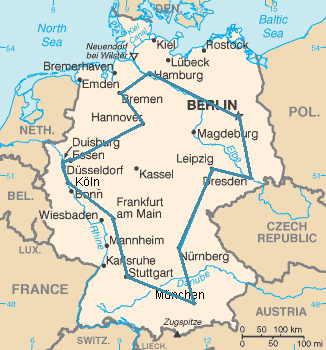

# How to Tackle an Optimization Problem with Constraint Programming

Case study: the travelling salesman problem

## TLDR

Constraint Programming is a technique of choice for solving a Constraint Satisfaction Problem.
In this article, we will see that it is also well suited to small to medium optimization problems.
Using the well-known [travelling salesman problem](https://en.wikipedia.org/wiki/Travelling_salesman_problem)
(TSP) as an example, we will detail all the steps leading to an efficient model.

For the sake of simplicity, we will consider the symmetric case of the TSP
(the distance between two cities is the same in each opposite direction).

All the code examples in this article use [NuCS](https://github.com/yangeorget/nucs),
a fast constraint solver written 100% in Python that I am currently developing as a side project.
NuCS is released under the [MIT license](https://github.com/yangeorget/nucs/blob/main/LICENSE.md).

## The symmetric travelling salesman problem

Quoting Wikipedia :

> Given a list of cities and the distances between each pair of cities,
> what is the shortest possible route that visits each city exactly once and returns to the origin city?



[Source: Wikipedia](https://fr.wikipedia.org/wiki/Probl%C3%A8me_du_voyageur_de_commerce#/media/Fichier:TSP_Deutschland_3.png)

This is an NP-hard problem. From now on, let’s consider that there are $n$ cities.

The most naive formulation of this problem is to decide,
for each possible edge between cities, whether it belongs to the optimal solution.
The size of the search space is $2^{n*(n-1)/2}$ which is roughly $8.8e130$ for $n=30$
(much greater than the number of atoms in the universe).

It is much better to find, for each city, its successor.
The complexity becomes $n!$ which is roughly $2.6e32$ for $n=30$ (much smaller but still very large).

In the following,
we will benchmark our models with the following small TSP instances: GR17, GR21 and GR24.

GR17 is a $17$ nodes symmetrical TSP, its costs are defined by $17 x 17$ symmetrical matrix of successor costs:

```python
[
    [0, 633, 257, 91, 412, 150, 80, 134, 259, 505, 353, 324, 70, 211, 268, 246, 121],
    [633, 0, 390, 661, 227, 488, 572, 530, 555, 289, 282, 638, 567, 466, 420, 745, 518],
    [257, 390, 0, 228, 169, 112, 196, 154, 372, 262, 110, 437, 191, 74, 53, 472, 142],
    [91, 661, 228, 0, 383, 120, 77, 105, 175, 476, 324, 240, 27, 182, 239, 237, 84],
    [412, 227, 169, 383, 0, 267, 351, 309, 338, 196, 61, 421, 346, 243, 199, 528, 297],
    [150, 488, 112, 120, 267, 0, 63, 34, 264, 360, 208, 329, 83, 105, 123, 364, 35],
    [80, 572, 196, 77, 351, 63, 0, 29, 232, 444, 292, 297, 47, 150, 207, 332, 29],
    [134, 530, 154, 105, 309, 34, 29, 0, 249, 402, 250, 314, 68, 108, 165, 349, 36],
    [259, 555, 372, 175, 338, 264, 232, 249, 0, 495, 352, 95, 189, 326, 383, 202, 236],
    [505, 289, 262, 476, 196, 360, 444, 402, 495, 0, 154, 578, 439, 336, 240, 685, 390],
    [353, 282, 110, 324, 61, 208, 292, 250, 352, 154, 0, 435, 287, 184, 140, 542, 238],
    [324, 638, 437, 240, 421, 329, 297, 314, 95, 578, 435, 0, 254, 391, 448, 157, 301],
    [70, 567, 191, 27, 346, 83, 47, 68, 189, 439, 287, 254, 0, 145, 202, 289, 55],
    [211, 466, 74, 182, 243, 105, 150, 108, 326, 336, 184, 391, 145, 0, 57, 426, 96],
    [268, 420, 53, 239, 199, 123, 207, 165, 383, 240, 140, 448, 202, 57, 0, 483, 153],
    [246, 745, 472, 237, 528, 364, 332, 349, 202, 685, 542, 157, 289, 426, 483, 0, 336],
    [121, 518, 142, 84, 297, 35, 29, 36, 236, 390, 238, 301, 55, 96, 153, 336, 0],
]
```

Let's have a look at the first row:
$[0, 633, 257, 91, 412, 150, 80, 134, 259, 505, 353, 324, 70, 211, 268, 246, 121]$

These are the costs for the possible successors of node $0$ in the circuit.
If we except the first value $0$ (we don't want the successor of node $0$ to be node $0$)
then the minimal value is $70$ (when node $12$ is the successor of node $0$) and the maximal is $633$
(when node $1$ is the successor of node $0$).
This means that the cost associated to the successor of node $0$ in the circuit ranges between $70$ and $633$.

## Modeling the TSP

We are going to model our problem by reusing the
[CircuitProblem](https://github.com/yangeorget/nucs/blob/main/nucs/problems/circuit_problem.py)
provided off-the-shelf in NuCS.
But let's first understand what happens behind the scene.
The `CircuitProblem` is itself a subclass of the
[Permutation problem](https://github.com/yangeorget/nucs/blob/main/nucs/problems/permutation_problem.py),
another off-the-shelf model offered by NuCS.

### The permutation problem

The permutation problem defines two redundant models: the successors and predecessors models.

```python
def __init__(self, n: int):
    """
    Inits the permutation problem.
    :param n: the number variables/values
    """
    self.n = n
    shr_domains = [(0, n - 1)] * 2 * n
    super().__init__(shr_domains)
    self.add_propagator((list(range(n)), ALG_ALLDIFFERENT, []))
    self.add_propagator((list(range(n, 2 * n)), ALG_ALLDIFFERENT, []))
    for i in range(n):
        self.add_propagator((list(range(n)) + [n + i], ALG_PERMUTATION_AUX, [i]))
        self.add_propagator((list(range(n, 2 * n)) + [i], ALG_PERMUTATION_AUX, [i]))
```

The successors model (the first n variables) defines, for each node, its successor in the circuit.
The successors have to be different.
The predecessors model (the last n variables) defines, for each node, its predecessor in the circuit.
The predecessors have to be different.

Both models are connected with the rules (see the `ALG_PERMUTATION_AUX constraints):

* if $succ[i] = j$ then $pred[j] = i$
* if $pred[j] = i$ then $succ[i] = j$
* if $pred[j] ≠ i$ then $succ[i] ≠ j$
* if $succ[i] ≠ j$ then $pred[j] ≠ i$

### The circuit problem

The circuit problem refines the domains of the successors and predecessors
and adds additional constraints for forbidding sub-cycles
(we won't go into them here for the sake of brevity).

```python
def __init__(self, n: int):
    """
    Inits the circuit problem.
    :param n: the number of vertices
    """
    self.n = n
    super().__init__(n)
    self.shr_domains_lst[0] = [1, n - 1]
    self.shr_domains_lst[n - 1] = [0, n - 2]
    self.shr_domains_lst[n] = [1, n - 1]
    self.shr_domains_lst[2 * n - 1] = [0, n - 2]
    self.add_propagator((list(range(n)), ALG_NO_SUB_CYCLE, []))
    self.add_propagator((list(range(n, 2 * n)), ALG_NO_SUB_CYCLE, []))
```

### The TSP model

With the help of the circuit problem, modelling the TSP is an easy task.

Let's consider a node $i$, as seen before $costs[i]$ is the list of possible costs for the successors of $i$.
If $j$ is the successor of $i$ then the associated cost is ${costs[i]}_{j}$.
This is implemented by the following line where $succ_costs$ if the starting index of the successors costs:

```python
self.add_propagators([([i, self.succ_costs + i], ALG_ELEMENT_IV, costs[i]) for i in range(n)])
```

Symmetrically, for the predecessors costs we get:

```python
self.add_propagators([([n + i, self.pred_costs + i], ALG_ELEMENT_IV, costs[i]) for i in range(n)])
```

Finally, we can define the total cost by summing the intermediate costs and we get:

```python
def __init__(self, costs: List[List[int]]) -> None:
    """
    Inits the problem.
    :param costs: the costs between vertices as a list of lists of integers
    """
    n = len(costs)
    super().__init__(n)
    max_costs = [max(cost_row) for cost_row in costs]
    min_costs = [min([cost for cost in cost_row if cost > 0]) for cost_row in costs]
    self.succ_costs = self.add_variables([(min_costs[i], max_costs[i]) for i in range(n)])
    self.pred_costs = self.add_variables([(min_costs[i], max_costs[i]) for i in range(n)])
    self.total_cost = self.add_variable((sum(min_costs), sum(max_costs)))  # the total cost
    self.add_propagators([([i, self.succ_costs + i], ALG_ELEMENT_IV, costs[i]) for i in range(n)])
    self.add_propagators([([n + i, self.pred_costs + i], ALG_ELEMENT_IV, costs[i]) for i in range(n)])
    self.add_propagator(
        (list(range(self.succ_costs, self.succ_costs + n)) + [self.total_cost], ALG_AFFINE_EQ, [1] * n + [-1, 0])
    )
    self.add_propagator(
        (list(range(self.pred_costs, self.pred_costs + n)) + [self.total_cost], ALG_AFFINE_EQ, [1] * n + [-1, 0])
    )
```

Note that it is not necessary to have both successors and predecessors models (one would suffice) but it is more
efficient.

## Branching

Let's use the default branching strategy of the `BacktrackSolver`,
our decision variables will be the successors and predecessors.

```python
solver = BacktrackSolver(problem, decision_domains=decision_domains)
solution = solver.minimize(problem.total_cost)
```

The optimal solution is found in 248s on a MacBook Pro M2 running Python 3.12, Numpy 2.0.1, Numba 0.60.0 and NuCS 4.2.0.
The detailed statistics provided by NuCS are:

```python
{
    'ALG_BC_NB': 16141979,
    'ALG_BC_WITH_SHAVING_NB': 0,
    'ALG_SHAVING_NB': 0,
    'ALG_SHAVING_CHANGE_NB': 0,
    'ALG_SHAVING_NO_CHANGE_NB': 0,
    'PROPAGATOR_ENTAILMENT_NB': 136986225,
    'PROPAGATOR_FILTER_NB': 913725313,
    'PROPAGATOR_FILTER_NO_CHANGE_NB': 510038945,
    'PROPAGATOR_INCONSISTENCY_NB': 8070394,
    'SOLVER_BACKTRACK_NB': 8070393,
    'SOLVER_CHOICE_NB': 8071487,
    'SOLVER_CHOICE_DEPTH': 15,
    'SOLVER_SOLUTION_NB': 98
}
```

In particular, there are $8070393$ backtracks. Let's try to improve on this.

NuCS offers a heuristic based on regret (difference between best and second best costs) for selecting the variable.
We will then choose the value that minimizes the cost.

```python
solver = BacktrackSolver(
    problem,
    decision_domains=decision_domains,
    var_heuristic_idx=VAR_HEURISTIC_MAX_REGRET,
    var_heuristic_params=costs,
    dom_heuristic_idx=DOM_HEURISTIC_MIN_COST,
    dom_heuristic_params=costs
)
solution = solver.minimize(problem.total_cost)
```

With these new heuristics, the optimal solution is found in 38s and the statistics are:

```python
{
    'ALG_BC_NB': 2673045,
    'ALG_BC_WITH_SHAVING_NB': 0,
    'ALG_SHAVING_NB': 0,
    'ALG_SHAVING_CHANGE_NB': 0,
    'ALG_SHAVING_NO_CHANGE_NB': 0,
    'PROPAGATOR_ENTAILMENT_NB': 12295905,
    'PROPAGATOR_FILTER_NB': 125363225,
    'PROPAGATOR_FILTER_NO_CHANGE_NB': 69928021,
    'PROPAGATOR_INCONSISTENCY_NB': 1647125,
    'SOLVER_BACKTRACK_NB': 1647124,
    'SOLVER_CHOICE_NB': 1025875,
    'SOLVER_CHOICE_DEPTH': 36,
    'SOLVER_SOLUTION_NB': 45
}
```

In particular, there are 1 647 124 backtracks.

We can keep improving by designing a
[custom heuristic](https://github.com/yangeorget/nucs/blob/main/nucs/examples/tsp/tsp_var_heuristic.py)
which combines max regret and smallest domain for variable selection.

```python
tsp_var_heuristic_idx = register_var_heuristic(tsp_var_heuristic)
solver = BacktrackSolver(
    problem,
    decision_domains=decision_domains,
    var_heuristic_idx=tsp_var_heuristic_idx,
    var_heuristic_params=costs,
    dom_heuristic_idx=DOM_HEURISTIC_MIN_COST,
    dom_heuristic_params=costs
)
solution = solver.minimize(problem.total_cost)
```

The optimal solution is now found in 11s and the statistics are:

```python
{
    'ALG_BC_NB': 660718,
    'ALG_BC_WITH_SHAVING_NB': 0,
    'ALG_SHAVING_NB': 0,
    'ALG_SHAVING_CHANGE_NB': 0,
    'ALG_SHAVING_NO_CHANGE_NB': 0,
    'PROPAGATOR_ENTAILMENT_NB': 3596146,
    'PROPAGATOR_FILTER_NB': 36847171,
    'PROPAGATOR_FILTER_NO_CHANGE_NB': 20776276,
    'PROPAGATOR_INCONSISTENCY_NB': 403024,
    'SOLVER_BACKTRACK_NB': 403023,
    'SOLVER_CHOICE_NB': 257642,
    'SOLVER_CHOICE_DEPTH': 33,
    'SOLVER_SOLUTION_NB': 52
}
```

In particular, there are 403 023 backtracks.

### How does minimization work BTW?

Minimization (and more generally optimization) relies on a
[branch-and-bound](https://en.wikipedia.org/wiki/Branch_and_bound) algorithm.
The backtracking mechanism allows to explore the search space by making choices (**branching**).
Parts of the search space are pruned by **bounding** the objective variable.

> When minimizing a variable $t$, one can add the additional constraint $t < s$
> whenever an intermediate solution $s$ is found.

NuCS offes two optimization modes corresponding to two ways to leverage $t < s$:

* the `RESET` mode restarts the search from scratch and updates the bounds of the target variable
* the `PRUNE` mode modifies the choice points to take into account the new bounds of the target variable

Let's now try the `PRUNE` mode:

```python
solution = solver.minimize(problem.total_cost, mode=PRUNE)
```

The optimal solution is found in 5.4s and the statistics are:

```python
{
    'ALG_BC_NB': 255824,
    'ALG_BC_WITH_SHAVING_NB': 0,
    'ALG_SHAVING_NB': 0,
    'ALG_SHAVING_CHANGE_NB': 0,
    'ALG_SHAVING_NO_CHANGE_NB': 0,
    'PROPAGATOR_ENTAILMENT_NB': 1435607,
    'PROPAGATOR_FILTER_NB': 14624422,
    'PROPAGATOR_FILTER_NO_CHANGE_NB': 8236378,
    'PROPAGATOR_INCONSISTENCY_NB': 156628,
    'SOLVER_BACKTRACK_NB': 156627,
    'SOLVER_CHOICE_NB': 99143,
    'SOLVER_CHOICE_DEPTH': 34,
    'SOLVER_SOLUTION_NB': 53
}
```

In particular, there are only 156 627 backtracks.

## Conclusion

The table below summarizes our experiments:

| Instance | Time(s) | Backtracks(k) | Branching           | Optimization mode |
|----------|---------|---------------|---------------------|-------------------|
| GR17     | 248     | 8070          | default             | default           |
| GR17     | 38      | 1647          | max regret/min cost | default           |
| GR17     | 11      | 403           | custom              | default           |
| GR17     | 5       | 156           | custom              | PRUNE             |
| GR21     | 8       | 184           | custom              | PRUNE             |
| GR24     | 43      | 737           | custom              | PRUNE             |

You can find all the corresponding code
[here](https://github.com/yangeorget/nucs/tree/main/nucs/examples/tsp).

There are of course many other tracks that we could explore to improve these results:

* design a
[redundant constraint](https://github.com/yangeorget/nucs/blob/main/nucs/examples/tsp/total_cost_propagator.py)
for the total cost
* improve the branching by exploring new heuristics
* use a different consistency algorithm (NuCS comes with shaving)
* ompute lower and upper bounds using other techniques

The travelling salesman problem has been the subject of extensive study and an abundant literature.
In this article,
we hope to have convinced the reader that it is possible to find optimal solutions to medium-sized problems in a very short time,
without having much knowledge of the travelling salesman problem.

---

Some useful links to go further with NuCS:

* the source code: https://github.com/yangeorget/nucs
* the documentation: https://nucs.readthedocs.io/en/latest/index.html
* the Pip package: https://pypi.org/project/NUCS/