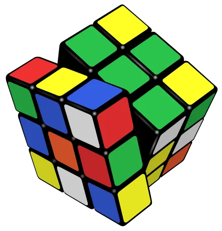
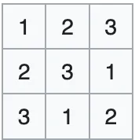

# Using Constraint Programming to Solve Math Theorems

Case study: the quasigroups existence problem

## TLDR

Some mathematical theorems can be solved by combinatorial exploration.
In this article, we focus on the problem of the existence of some quasigroups.
We will demonstrate the existence or non existence of some quasigroups using [NuCS](https://github.com/yangeorget/nucs).
NuCS is a fast constraint solver written 100% in Python that I am currently developing as a side project.
It is released under the [MIT license](https://github.com/yangeorget/nucs/blob/main/LICENSE.md).

## Some definitions

Let's start by defining some useful vocabulary.

### Groups

Quoting wikipedia:

> In mathematics, a group is a set with an operation that associates an element of the set to every pair of elements of
> the set (as does every binary operation) and satisfies the following constraints: the operation is associative, it has
> an identity element, and every element of the set has an inverse element.

The set of integers (positive and negative) together with the addition form a group.
There are many of kind of groups, for example the manipulations of
the [Rubik's Cube](https://en.wikipedia.org/wiki/Rubik%27s_Cube).



### Latin Squares

> A Latin square is an $n × n$ array filled with $n$ different symbols, each occurring exactly once in each row and
> exactly once in each column.

An example of a $3×3$ Latin square is:



> For example, a Sudoku is a $9x9$ Latin square with additional properties.

### Quasigroups

> An order m quasigroup is a Latin square of size $m$
> That is, an $m×m$ multiplication table (we will note $*$ the multiplication symbol) in which each element occurs once
> in every row and column.

The multiplication law does not have to be associative.
If it is, the quasigroup is a group.

In the rest of this article, we will focus on the problem of the existence of some particular quasigroups.
The quasigroups we are interested in are idempotent, that is $a∗a=a$ for every element $a$.

Moreover, they have additional properties:

* QG3.m problems are order $m$ quasigroups for which $(a∗b)∗(b∗a)=a$.
* QG4.m problems are order $m$ quasigroups for which $(b∗a)∗(a∗b)=a$.
* QG5.m problems are order $m$ quasigroups for which $((b∗a)∗b)∗b=a$.
* QG6.m problems are order $m$ quasigroups for which $(a∗b)∗b=a∗(a∗b)$.
* QG7.m problems are order $m$ quasigroups for which $(b∗a)∗b=a∗(b∗a)$.

In the following, for a quasigroup of order $m$, we note $0, ..., m-1$ the values of the quasigroup
(we want the values to match with the indices in the multiplication table).

## Modelling the quasigroup problem

### Latin square models

We will model the quasigroup problem by leveraging the latin square problem.
The former comes in 2 flavors:

* the **LatinSquareProblem**,
* the **LatinSquareRCProblem**.

The LatinSquareProblem simply states that the values in all the rows and columns of the multiplication table have to be
different:

```python
self.add_propagators([(self.row(i), ALG_ALLDIFFERENT, []) for i in range(self.n)])
self.add_propagators([(self.column(j), ALG_ALLDIFFERENT, []) for j in range(self.n)])
```

This model defines, for each row $i$ and column $$, the value $color(i, j)$ of the cell.
We will call it the color model.
Symmetrically, we can define:

* for each row $i$ and color $c$, the column $column(i, c)$: we call this the column model,
* for each color $c$ and column $j$, the row $row(c, j)$: we call this the row model.

Note that we have the following properties:

* $row(c, j) = i <=> color(i, j) = c$

For a given column $j$, $row(., j)$ and $color(., j)$ are inverse permutations.

* $row(c, j) = i <=> column(i, c) = j$

For a given color $c$, $row(c, .)$ and $column(., c)$ are inverse permutations.

* $color(i, j) = c <=> column(i, c) = j$

For a given row $i$, $color(i, .)$ and $column(i, .)$ are inverse permutations.

This is exactly what is implemented by the LatinSquareRCProblem with the help of the ALG_PERMUTATION_AUX propagator
(note that a less optimized version of this propagator was also used in my previous article about the Travelling
Salesman Problem):

```python
def __init__(self, n: int):
    super().__init__(list(range(n)))  # the color model
    self.add_variables([(0, n - 1)] * n ** 2)  # the row model
    self.add_variables([(0, n - 1)] * n ** 2)  # the column model
    self.add_propagators([(self.row(i, M_ROW), ALG_ALLDIFFERENT, []) for i in range(self.n)])
    self.add_propagators([(self.column(j, M_ROW), ALG_ALLDIFFERENT, []) for j in range(self.n)])
    self.add_propagators([(self.row(i, M_COLUMN), ALG_ALLDIFFERENT, []) for i in range(self.n)])
    self.add_propagators([(self.column(j, M_COLUMN), ALG_ALLDIFFERENT, []) for j in range(self.n)])
    # row[c,j]=i <=> color[i,j]=c
    for j in range(n):
        self.add_propagator(([*self.column(j, M_COLOR), *self.column(j, M_ROW)], ALG_PERMUTATION_AUX, []))
    # row[c,j]=i <=> column[i,c]=j
    for c in range(n):
        self.add_propagator(([*self.row(c, M_ROW), *self.column(c, M_COLUMN)], ALG_PERMUTATION_AUX, []))
    # color[i,j]=c <=> column[i,c]=j
    for i in range(n):
        self.add_propagator(([*self.row(i, M_COLOR), *self.row(i, M_COLUMN)], ALG_PERMUTATION_AUX, []))
```

### Quasigroup model

Now we need to implement our additional properties for our quasigroups.

Idempotence is simply implemented by:

```python
for model in [M_COLOR, M_ROW, M_COLUMN]:
    for i in range(n):
        self.shr_domains_lst[self.cell(i, i, model)] = [i, i]
```

Let's now focus on QG5.m. We need to implement $((b∗a)∗b)∗b=a$:

* this translates into: $color(color(color(j, i), j), j) = i$,
* or equivalently: $row(i, j) = color(color(j, i), j)$.

The last expression states that the $color(j,i)th$ element of the $jth$ column is $row(i, j)$.
To enforces this, we can leverage the ALG_ELEMENT_LIV propagator
(or a more specialized ALG_ELEMENT_LIV_ALLDIFFERENT optimized to take into account the fact that the rows and columns
contain elements that are all different).

```python
for i in range(n):
    for j in range(n):
        if j != i:
            self.add_propagator(
                (
                    [*self.column(j), self.cell(j, i), self.cell(i, j, M_ROW)],
                    ALG_ELEMENT_LIV_ALLDIFFERENT,
                    [],
                )
            )
```

Similarly, we can model the problems
[QG3.m](https://github.com/yangeorget/nucs/blob/main/nucs/examples/quasigroup/quasigroup_problem.py),
[QG4.m](https://github.com/yangeorget/nucs/blob/main/nucs/examples/quasigroup/quasigroup_problem.py),
[QG6.m](https://github.com/yangeorget/nucs/blob/main/nucs/examples/quasigroup/quasigroup_problem.py),
[QG7.m](https://github.com/yangeorget/nucs/blob/main/nucs/examples/quasigroup/quasigroup_problem.py).

## Experiments

Note that this problem is very hard since the size of the search space is $`m^{m^2}`$. For $m=10$, this is $1e+100$.

The following experiments are performed on a MacBook Pro M2 running Python 3.13, Numpy 2.1.3, Numba 0.61.0rc2 and NuCS
4.6.0.
Note that the recent versions of NuCS are relatively faster than older ones since Python, Numpy and Numba have been
upgraded.

The following proofs of existence/non-existence are obtained in less than a second:

| m     | 5   | 6  | 7   | 8   | 9   |
|-------|-----|----|-----|-----|-----|
| QG3.m | No  | No | No  | Yes | No  |
| QG4.m | Yes | No | No  | No  | Yes |
| QG5.m | Yes | No | Yes | Yes | No  |
| QG6.m | No  | No | No  | Yes | Yes |
| QG7.m | Yes | No | No  | No  | Yes |

Let's now focus on **QG5.m** only where the first open problem is **QG5.18**.

| m            | 10 | 11 | 12 | 13  | 14   | 15 |
|--------------|----|----|----|-----|------|----|
| 1 processor  | 1s | 1s | 3s | 85s |      |    |
| 6 processors |    |    |    | 37s | 10mn | 8h |

Going further would require to rent a powerful machine on a cloud provider during a few days at least!

## Conclusion

As we have seen, some mathematical theorems can be solved by combinatorial exploration.
In this article, we studied the problem of the existence/non-existence of quasigroups.
Among such problems, some open ones seem to be accessible, which is very stimulating.

Some ideas to improve on our current approach to quasigroups existence:

* refine the model which is still fairly simple
* explore more sophisticated heuristics
* run the code on the cloud (using docker, for example)

---

Some useful links to go further with NuCS:

* the source code: https://github.com/yangeorget/nucs
* the documentation: https://nucs.readthedocs.io/en/latest/index.html
* the Pip package: https://pypi.org/project/NUCS/