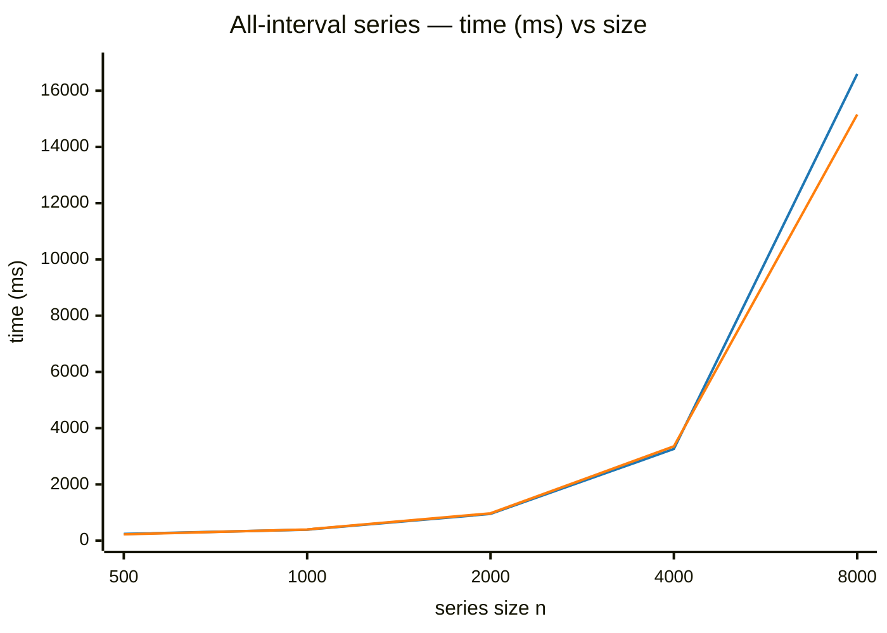
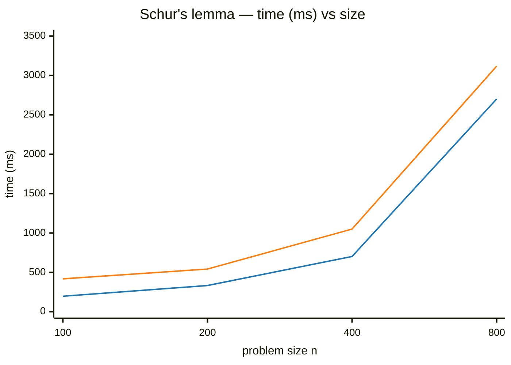
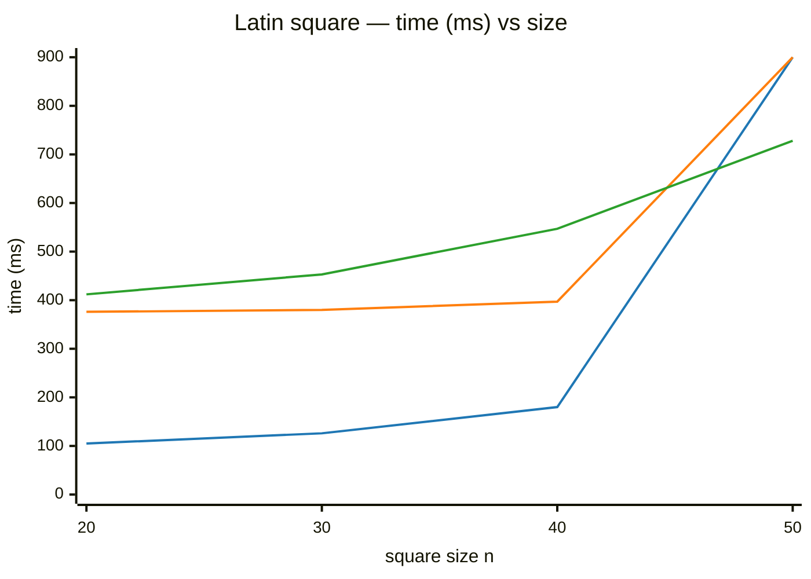
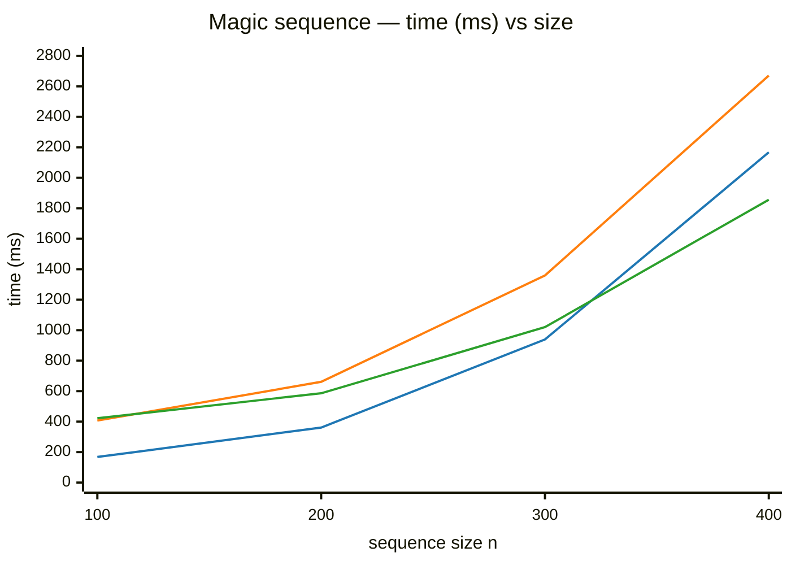
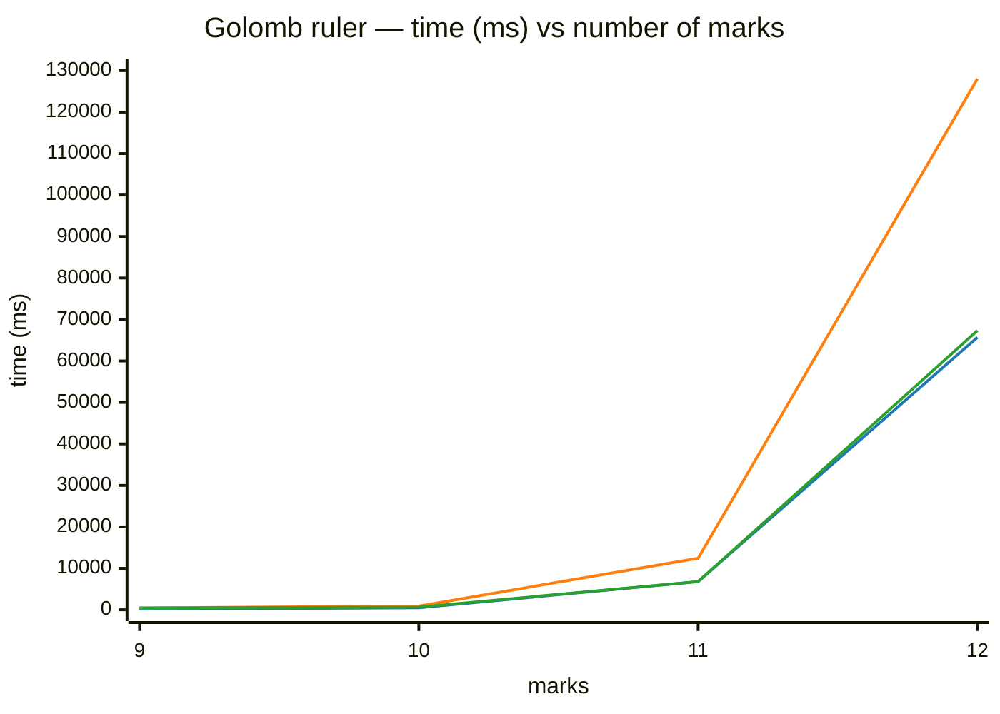

# NuCS vs Choco: a pure-Python solver meets a JVM veteran

## TL;DR

[NuCS](https://github.com/yangeorget/nucs) is a constraint solver written 100% in Python, accelerated by
[NumPy](https://numpy.org/) and [Numba](https://numba.pydata.org/).
[Choco](https://github.com/chocoteam/choco-solver) is one of the reference open-source constraint solvers,
written in Java and developed for more than two decades.

Comparing them looks lopsided: an interpreted language against a heavily optimized JVM solver with a rich catalog of
arc-consistent global constraints. The reality is more interesting. When both solvers run the *same* model they are, for
all practical purposes, **the same speed** — the Python tax disappears once Numba has compiled the inner loops. When the
models differ the result is a genuine trade rather than a rout: on some problems Choco's arc consistency is the right,
fast tool; on others NuCS's cheap bound consistency plus a little remodeling wins; and on at least one problem NuCS's
modeling freedom lets it solve instances that *neither* plain solver can.

This article walks through five benchmark problems, draws the performance curves for each, and ends on the design
decision that explains the whole picture: **NuCS represents domains as `min..max` intervals and is therefore limited to
bound consistency, while Choco can also represent domains with holes and run full arc consistency.**

All NuCS code shown here lives in the [NuCS repository](https://github.com/yangeorget/nucs) under the
[MIT license](https://github.com/yangeorget/nucs/blob/main/LICENSE.md).

---

## NuCS

### History

NuCS is a young project. Its first public releases date from 2024, and it has iterated very quickly since — the version
benchmarked here is **11.2.0**. It was built around a deliberately unusual bet: write a competitive finite-domain
constraint solver **entirely in Python**, and recover the performance normally lost to interpretation through
just-in-time compilation rather than a C or C++ core. It is distributed on PyPI (`pip install nucs`), which keeps
installation as simple as any other Python package — no native toolchain, no JVM.

### Architecture

A `Problem` carries a NumPy array of variable domains — one `(min, max)` pair per variable, a variable being *bound*
when `min == max` — together with a list of *propagators*. A propagator is a constraint's filtering algorithm,
registered under a numeric `ALG_*` identifier. Each propagator is three small functions:

- `compute_domains_*` — the actual filtering, returning *inconsistency*, *consistency*, or *entailment*;
- `get_triggers_*` — which domain events should re-wake the propagator;
- `get_complexity_*` — a cost estimate used to order the propagation queue.

The `BacktrackSolver` interleaves propagation-to-a-fixpoint with a branching decision, chosen by a *variable heuristic*
(which unbound variable to branch on) and a *domain heuristic* (which value to try). A `MultiprocessingSolver` fans
several backtracking searches out over a split of the search space.

What makes this fast despite being Python is that essentially every hot function is decorated with
`@njit(cache=True, fastmath=True)`. Numba compiles these to native code on first use and caches the result on disk, so a
*warm* process runs compiled machine code, not interpreted bytecode. Domains are plain NumPy arrays mutated in place,
and propagators exchange typed `NDArray`s and integers — never Python objects. The price is a cold-start compilation
(mitigated by the cache) and a coding discipline inside jitted code: no dictionaries, no exceptions, no `isinstance`, no
strings. The payoff is twofold: C-like throughput, and **cheap, fast modeling** — adding a redundant constraint,
swapping a heuristic, or writing a problem-specific consistency algorithm is a handful of lines of ordinary Python. As
we will see, that second property is where several of NuCS's wins come from.

The single most consequential design choice is that a domain is *always an interval*. There is no representation for a
hole in the middle of a domain, which is exactly what makes the whole engine expressible as operations on two NumPy
arrays — and what limits NuCS to **bound consistency**. We will return to this at the end; it is the thread running
through every result below.

---

## Choco

### History

Choco is a veteran of the constraint-programming world. It first appeared around the turn of the 2000s and has been
through several full rewrites. The modern lineage — **Choco 3, then 4, and now 6** — is a ground-up redesign developed
largely at IMT Atlantique (the TASC / LS2N research group in Nantes) by Charles Prud'homme, Jean-Guillaume Fages and
contributors. It is an open-source Java library, distributed under a BSD license, and is widely used in both research
and industry. The version benchmarked here is **6.0.1**, a current release.

### Architecture

Choco is an event-based constraint solver on the JVM. A `Model` holds integer, boolean, set and real variables together
with `Constraint`s; each constraint delegates filtering to one or more *propagators* driven by a fine-grained
event/propagation engine. On top sits a configurable search loop with a large library of branching strategies, restart
policies, and — historically a distinctive feature — **explanations** (conflict-based learning).

Where Choco fundamentally differs from NuCS is in its **domain representation**: it supports both *bounded* domains
(intervals, like NuCS) and *enumerated* domains (bitsets), which can represent arbitrary subsets — domains *with holes*.
That richer representation is what unlocks the **breadth and strength of its global-constraint catalog**: `allDifferent`
at several consistency levels (including Régin's arc-consistent algorithm), cardinality and counting constraints,
`cumulative`, `circuit`, automaton/regular constraints, and many more, most backed by carefully engineered, often
**arc-consistent**, filtering.

A mature JVM solver brings two things a young Python project cannot match today: a JIT (HotSpot) tuned over twenty
years, and a deep library of strong global constraints you can drop into a model and trust. The flip side is that those
strong filters are also where Choco can become *expensive*: arc-consistent global constraints do a lot of work per node,
and that work does not always pay for itself.

---

## The comparison setup

| Component | NuCS side                  | Choco side                    |
|-----------|----------------------------|-------------------------------|
| Solver    | NuCS **11.2.0**            | choco-solver **6.0.1**        |
| Runtime   | CPython + Numba **0.65.1** | Java **26.0.1** (HotSpot JVM) |
| Numerics  | NumPy **2.4.6**            | —                             |

A few honest caveats before reading any number:

- All timings are in **milliseconds**, measured on the same machine. Cross-language micro-benchmarks are always
  approximate; treat *ratios and curve shapes*, not absolute values, as the signal.
- NuCS timings are taken **after** the Numba JIT cache is warm — the one-off compilation cost is not what we want to
  measure. Even warm, NuCS pays a small **fixed startup cost** of a few hundred milliseconds (reading the cache, warming
  NumPy) that you can see as a floor on the smallest instances. It is paid once per process, not per search node, so it
  is noise for a long solve and dominant for a tiny one.
- Each problem below shows a **curve diagram** (lower is better) followed by the raw table and a short analysis. In any
  "speedup" column, a value greater than 1 means **NuCS is faster** by that factor.

The five problems split naturally into two groups: those where **both solvers run essentially the same model** (so we
are comparing engines) and those where **the models differ** (so we are comparing modeling strategies as much as
engines).

---

## Group 1 — same model, comparing engines

### All-interval series (find one solution)

Both solvers use bound consistency and a first-fail heuristic on the same formulation (CSPLIB #7): a permutation of
`0..n-1` whose consecutive absolute differences are themselves all different. The NuCS model is literally:

```python
for i in range(n - 1):
    self.add_propagator(ALG_SUM_EQ, [n + i, i, i + 1])       # diff_i = x_{i+1} - x_i
    self.add_propagator(ALG_ABS_EQ, [n + i, 2 * n - 1 + i])  # |diff_i|
self.add_propagator(ALG_ALLDIFFERENT, range(n))
self.add_propagator(ALG_ALLDIFFERENT, range(2 * n - 1, 3 * n - 2))
```



_Series order: **Choco** (blue), **NuCS** (orange). Lower is better._

| size | Choco (BC, ff) | NuCS (BC, ff) | speedup |
|------|---------------:|--------------:|--------:|
| 500  |            240 |           225 |   1.07× |
| 1000 |            392 |           398 |   0.98× |
| 2000 |            950 |           972 |   0.98× |
| 4000 |           3261 |          3352 |   0.97× |
| 8000 |          16595 |         15153 |   1.10× |

This is the most telling chart in the whole benchmark *because nothing differs except the engine* — and the two curves
sit on top of each other. A pure-Python solver running neck-and-neck with Choco on an identical model, even edging ahead
at the largest instance, is the headline result: once Numba has compiled the propagators, the Python tax is gone.

### Schur's lemma (prove no solution)

Same idea, different problem (CSPLIB #15): partition `1..n` into 3 sum-free sets — here proven infeasible, so the entire
search tree must be explored. Both solvers use bound consistency.



_Series order: **Choco** (blue), **NuCS** (orange). Lower is better._

| size | Choco (BC) | NuCS (BC) | speedup |
|------|-----------:|----------:|--------:|
| 100  |        197 |       418 |   0.47× |
| 200  |        333 |       542 |   0.61× |
| 400  |        702 |      1050 |   0.67× |
| 800  |       2701 |      3118 |   0.87× |

Here Choco is genuinely faster — about 2× at the smallest size. But notice how the gap moves: 0.47× → 0.61× → 0.67× →
0.87× as the problem grows. That shrinking deficit is NuCS's roughly constant per-process overhead being amortized
against a growing absolute runtime; by n=800 the two engines are within ~15% and clearly **converging**. NuCS pays a
setup cost here, not an algorithmic one.

**Takeaway for Group 1.** When the model is fixed, NuCS and Choco run at essentially the same asymptotic speed. The only
visible difference is a small, constant NuCS startup cost that dominates tiny instances and vanishes on large ones —
which, for a pure-Python solver against a two-decade-old JVM engine, is already a strong result.

---

## Group 2 — different models, comparing strategies

On these three problems the two solvers do not run the same algorithm, so we are comparing *modeling strategies* as much
as engines. Choco reaches for strong, arc-consistent global constraints or enumerated domains; NuCS reaches for cheap
bound consistency plus redundant constraints, channeling, or a hand-written filter. The results are mixed — and that is
the honest, interesting part.

### Latin square (find one solution)

A Latin square is an n×n grid where every row and every column is a permutation of `0..n-1`. The straightforward model,
used by both solvers, posts a bound-consistent `allDifferent` per row and per column:

```python
for i in range(self.n):
    self.add_propagator(ALG_ALLDIFFERENT, self.row(i))
    self.add_propagator(ALG_ALLDIFFERENT, self.column(i))
```

NuCS also ships a **redundant** model (`LatinSquareRCProblem`) that adds two extra views of the same grid — one indexed
by *(color, column) → row*, one by *(row, color) → column* — and links the three with channeling (`permutation`)
constraints, so that pruning discovered in one view immediately propagates to the others:

```python
# color[i,j]=c  <=>  row[c,j]=i  <=>  column[i,c]=j
self.add_propagator(ALG_PERMUTATION_AUX, [*self.column(j), *self.column(j, M_ROW)])
self.add_propagator(ALG_PERMUTATION_AUX, [*self.row(c, M_ROW), *self.column(c, M_COLUMN)])
self.add_propagator(ALG_PERMUTATION_AUX, [*self.row(i), *self.row(i, M_COLUMN)])
```



_Series order: **Choco (BC)** (blue), **NuCS (BC)** (orange), **NuCS (BC + redundant)** (green). At n=50 the two
plain-BC lines leap to the top of the chart: this marks **"did not finish"**, not a measured time. NuCS with redundant
constraints is the only model that completes n=50 — in 728 ms. Lower is better._

| size | Choco (BC)       | NuCS (BC)        | NuCS (BC + redundant) |
|------|-----------------:|-----------------:|----------------------:|
| 20   |              105 |              376 |                   412 |
| 30   |              126 |              380 |                   453 |
| 40   |              180 |              397 |                   547 |
| 50   | ✗ did not finish | ✗ did not finish |                   728 |

Two things to read here. First, on the *same* (plain-BC) model, Choco is faster than NuCS on the small solvable
instances — the familiar constant-overhead gap, with NuCS sitting on its ~376 ms floor while Choco starts near 105 ms.
Second, and more important: **both plain-BC models fall off a cliff at order 50** and fail to finish. The plain
formulation simply does not prune enough, and that is an algorithmic wall, not an engine one — Choco hits it too.

The NuCS redundant model walks straight past that wall. Its curve is almost flat (412 → 728 ms while the order grows
from 20 to 50) because the channeled views prune so much that search barely expands. The win here is not a tidy speedup
ratio; it is **qualitative** — NuCS solves, in well under a second, an instance that neither plain-BC solver can finish
at all. And the thing that made it possible is not the engine but the *ease of remodeling*: three extra propagator loops
in ordinary Python.

### Magic sequence (find one solution)

A magic sequence (CSPLIB #19) is a sequence where `x_i` equals the number of occurrences of `i`. The natural Choco model
uses a **strong arc-consistent global constraint**, which is powerful. The NuCS model uses only simple `count`
constraints plus a redundant linear constraint (the values must sum to `n`); a stronger variant adds **one extra
redundant constraint**, a weighted-sum identity:

```python
for i in range(n):
    self.add_propagator(ALG_COUNT_EQ, list(range(n)) + [i], [i])
self.add_propagator(ALG_SUM_EQ_C, range(n), [n])            # redundant
self.add_propagator(ALG_AFFINE_EQ, range(n), range(n + 1))  # one extra redundant
```



_Series order: **Choco (AC)** (blue), **NuCS (BC)** (orange), **NuCS (BC + 1 extra redundant)** (green). Lower is
better._

| size | Choco (AC) | NuCS (BC)  | NuCS (BC + 1 extra redundant) | speedup vs Choco |
|------|-----------:|-----------:|------------------------------:|-----------------:|
| 100  |        168 |        407 |                           422 |            0.40× |
| 200  |        361 |        661 |                           586 |            0.62× |
| 300  |        939 |       1359 |                          1020 |            0.92× |
| 400  |       2167 |       2671 |                          1856 |            1.17× |

This is the most balanced chart of the set. Choco's arc-consistent filtering is genuinely good here: at n=100 it is
~2.5× faster than NuCS. But its curve climbs faster than NuCS's — Choco grows ~13× from n=100 to n=400, while the
NuCS variant grows only ~4.4× — and the two curves **cross over around n=400**, where NuCS edges ahead (1856 vs
2167 ms). The extra redundant constraint earns its keep: at n=400 it cuts NuCS's time from 2671 to 1856 ms. The reading
is not "AC is wasteful" — here it clearly pays on small and mid instances — but "cheap BC plus a redundant constraint
has a flatter cost-per-node, so it catches up as the instance grows."

### Golomb ruler (minimize)

Golomb (CSPLIB #6) is the most interesting comparison because it leans hardest on domain representation. Choco's sample
uses **enumerated domains** — effectively a stronger consistency — which lets it prune values in the *middle* of the
distance intervals. Plain NuCS bound consistency cannot do that, and it shows. So NuCS offers a **problem-specific
consistency algorithm**: a few dozen lines of jitted Python (`golomb_consistency_algorithm`) that pre-prune the distance
variables with a minimal-sum-of-distinct-integers argument before running standard bound consistency.



_Series order: **Choco (enumerated domains)** (blue), **NuCS BC** (orange), **NuCS custom consistency** (green).
Lower is better._

| marks | Choco (enum. domains) | NuCS (BC) | NuCS (custom consistency) |
|-------|----------------------:|----------:|--------------------------:|
| 9     |                   202 |       438 |                       414 |
| 10    |                   481 |       883 |                       641 |
| 11    |                  6800 |     12428 |                      6791 |
| 12    |                 65705 |    128040 |                     67319 |

Plain NuCS BC (orange) is about **2× slower** than Choco across the board — exactly the penalty you would expect when
the opponent can prune holes you cannot. But the custom-consistency variant (green) closes the gap almost perfectly: at
11 marks, 6791 ms vs Choco's 6800 ms; at 12 marks, 67319 ms vs 65705 ms — within ~2%. NuCS does not need enumerated
domains to recover the missing pruning; it needs a **dedicated propagator** that encodes the same logic. The cost is
developer effort, not solver capability.

---

## What the numbers say

| Problem             | Models    | Outcome at scale                         | Margin                         |
|---------------------|-----------|------------------------------------------|--------------------------------|
| All-interval series | same (BC) | tie                                      | ~1×                            |
| Schur's lemma       | same (BC) | Choco, converging                        | ~1.15× at n=800                |
| Magic sequence      | different | Choco small, NuCS overtakes at scale     | crossover near n=400           |
| Golomb ruler        | different | Choco; tie with NuCS custom propagator   | ~2× plain, ~1× with custom     |
| Latin square        | different | NuCS solves what plain BC cannot         | qualitative (feasibility)      |

- **Equal models, equal speed.** When both solvers run the same algorithm, NuCS matches Choco. The only visible gap is a
  small, constant NuCS startup overhead that vanishes on larger instances.
- **Stronger consistency often pays — but its cost-per-node grows.** On magic sequence Choco's arc-consistent global
  constraint is faster on small and mid instances, yet NuCS's lightweight BC plus one extra redundant constraint has a
  flatter slope and overtakes it by n=400.
- **Modeling freedom can change feasibility, not just speed.** On Latin square the plain BC model walls out at order 50
  for *both* solvers; NuCS's redundant channeling model solves it in 728 ms — because remodeling in Python is cheap.
- **Sometimes AC really is decisive.** On Golomb ruler, enumerated domains give Choco pruning that plain BC simply
  cannot reproduce — and NuCS only catches up by writing a custom propagator.

---

## The root cause: domains and consistency

Step back from the individual problems and one design decision explains the whole picture.

**NuCS represents each variable domain as a single `min..max` interval.** A domain is two integers; binding a variable
means `min == max`. This is compact, cache-friendly, and trivially vectorizable with NumPy — which is precisely what
lets Numba make the propagators so fast. But it has a hard consequence: NuCS can only *shrink the bounds* of a domain. It
cannot punch a hole in the middle. The strongest filtering it can express is therefore **bound consistency (BC)** — it
guarantees the endpoints of each domain are supported, nothing more.

**Choco represents domains with holes** (bitset / enumerated representations alongside bounded ones). It can remove an
arbitrary value from the middle of a domain. That is what makes **arc consistency (AC)** possible: a filtering algorithm
can delete *every* unsupported value, not just trim the extremes. Choco's catalog leans into this — `allDifferent` (AC),
arc-consistent cardinality and counting constraints, enumerated-domain propagation — and these are exactly the
constraints behind its results on magic sequence and Golomb above.

So the two solvers occupy genuinely different points in the design space:

|                       | NuCS                                                           | Choco                                          |
|-----------------------|----------------------------------------------------------------|------------------------------------------------|
| Domain representation | `min..max` interval                                            | values with holes (bitset/enumerated)          |
| Strongest consistency | bound consistency (BC)                                         | arc consistency (AC)                           |
| Best at               | tight bounded models, vectorized propagation, cheap remodeling | strong global constraints, problems needing AC |
| Cost model            | very low per-node cost                                         | higher per-node cost, fewer nodes              |

And here is the nuance the benchmarks reveal. NuCS's "weaker" consistency is not always a disadvantage. Because BC
propagators are so cheap, and because remodeling in Python is so easy, the productive move in NuCS is to **recover the
missing pruning with redundant constraints, channeling, or a custom filter** rather than with an expensive AC algorithm.
On magic sequence that lower per-node cost lets BC catch and pass Choco's arc-consistent global constraint once the
instance is large enough; on Latin square it is the difference between solving order 50 and not solving it at all.

The flip side is just as real. When a problem genuinely needs values removed from the middle of domains, Choco's
arc-consistent globals and enumerated domains are the right tool out of the box — fast on small magic-sequence instances
and ahead on Golomb until NuCS answers with hand-written code. Choco gives you that strength for free; NuCS makes you
build it, but lets you build it in a few lines.

---

## Conclusion

Reading the benchmark as "which solver is faster" misses the point. Two different things are being measured:

1. **Same model, comparing engines (all-interval series, Schur's lemma).** The two are essentially tied: identical
   asymptotic speed, separated only by a small constant NuCS startup cost that shrinks to nothing on large instances.
   That a *pure-Python* solver runs within a hair of a mature, two-decade-old JVM solver — and pulls ahead on the
   largest all-interval instances — is the most pleasantly surprising outcome. Numba closes the Python penalty.

2. **Different models, comparing strategies (magic sequence, Golomb ruler, Latin square).** Here it is a genuine trade.
   Choco's arc consistency is fast and decisive on some instances (small magic sequences, Golomb); NuCS's cheap BC plus
   redundant constraints has a flatter cost curve and wins at scale on others (large magic sequences), recovers parity
   where AC led (Golomb, with a custom propagator), and — thanks to how cheap remodeling is — solves a Latin square that
   *neither* plain-BC model can.

Underneath both observations lies one architectural fact. **NuCS stores domains as `min..max` intervals and is therefore
limited to bound consistency; Choco stores domains with holes and can run arc consistency.** That is the honest, lasting
difference between the two solvers. It is why Choco ships strong AC global constraints that NuCS cannot replicate
directly, and it is *also* why NuCS's cheap-BC-plus-redundant-constraints style can compete — and sometimes win — when a
good redundant model exists. Neither approach dominates; they are different bets.

For someone who wants Choco's breadth of battle-tested, arc-consistent global constraints, mature search infrastructure,
and explanations, Choco remains the reference. For someone who wants to **experiment with models in Python and still get
native-code speed**, NuCS makes a strong case: the language is no longer the bottleneck, and the freedom to reshape the
model — adding redundancy, channeling, or a custom BC filter in a few lines — often matters as much as raw engine speed
or raw consistency strength.

---

Some useful links to go further with NuCS:

* the source code: https://github.com/yangeorget/nucs
* the documentation: https://nucs.readthedocs.io/en/latest/index.html
* the Pip package: https://pypi.org/project/NUCS/
