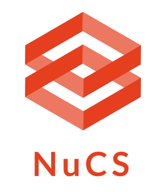

###############################
Welcome to NuCS' documentation!
###############################

NuCS is a 100% Python library leveraging Numpy and Numba.

* **Python** is a powerful and flexible programing language
  that allows to express complex problems in a few lines of code.
* **Numpy** is a Python library that provides a multidimensional array object,
  various derived objects (such as masked arrays and matrices),
  and an assortment of routines for fast operations on arrays.
* **Numba** translates Python functions to optimized machine code at runtime
  using the industry-standard LLVM compiler library.
  Numba-compiled numerical algorithms in Python can approach the speeds of C or FORTRAN.

Check out the :doc:`installation` section for further information to get started with NuCS!

.. note::

   This project is under active development.

********
Contents
********

.. toctree::
   :glob:

   installation
   variables
   domains
   propagators
   consistency
   solvers
   heuristics
   stats
   logging
   reference/reference_index.rst