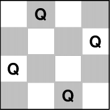

########
Problems
########

Modelling a problem to be solved consists in instantiating a :code:`Problem`.
While it is very common to start from scratch,
it is also possible to subclass some pre-defined :ref:`problems <problems>`.

********************************************
The constructor of the :code:`Problem` class
********************************************
The constructor of :code:`Problem` accepts a single argument:
the domains as a list of pairs of integers (if the minimal and maximal values of the pair are equal, the pair can be replaced by the value).

Python, with the help of lists and ranges, makes the construction of complex problems an easy task.

Propagators are then added to the problem with the use of the :code:`add_propagator` method.

****************************************
A concrete example: the 4-queens problem
****************************************

   4 non attacking queens

The 4-queens problem can be modelled as follows:

- for :math:`i` in :math:`[0, 3]`, :math:`v_i` is the vertical position of the queen in the :math:`i` th column
- :math:`v_0, v_1, v_2, v_3` are all different
- :math:`v_0, v_1 + 1, v_2 + 2, v_3 + 3` are all different
- :math:`v_0, v_1 - 1, v_2 - 2, v_3 - 3` are all different

In NuCS, the n-queens problem is indeed constructed as follows:

.. code-block:: python

   def __init__(self, n: int):
      super().__init__([(0, n - 1)] * n)
      super().__init__([(0, n - 1)] * n)
      variables = list(range(0, n))
      self.add_propagator(ALG_ALLDIFFERENT, variables)
      self.add_propagator(ALG_ALLDIFFERENT, variables, list(range(n)))
      self.add_propagator(ALG_ALLDIFFERENT, variables, list(range(0, -n, -1)))

