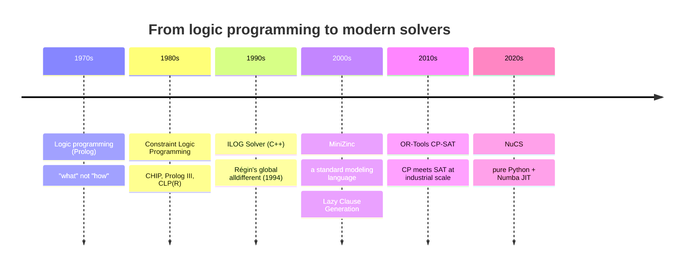
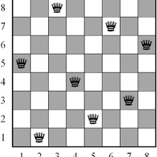
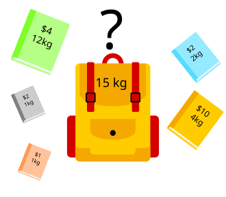
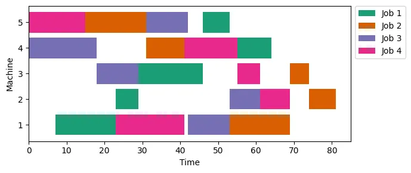
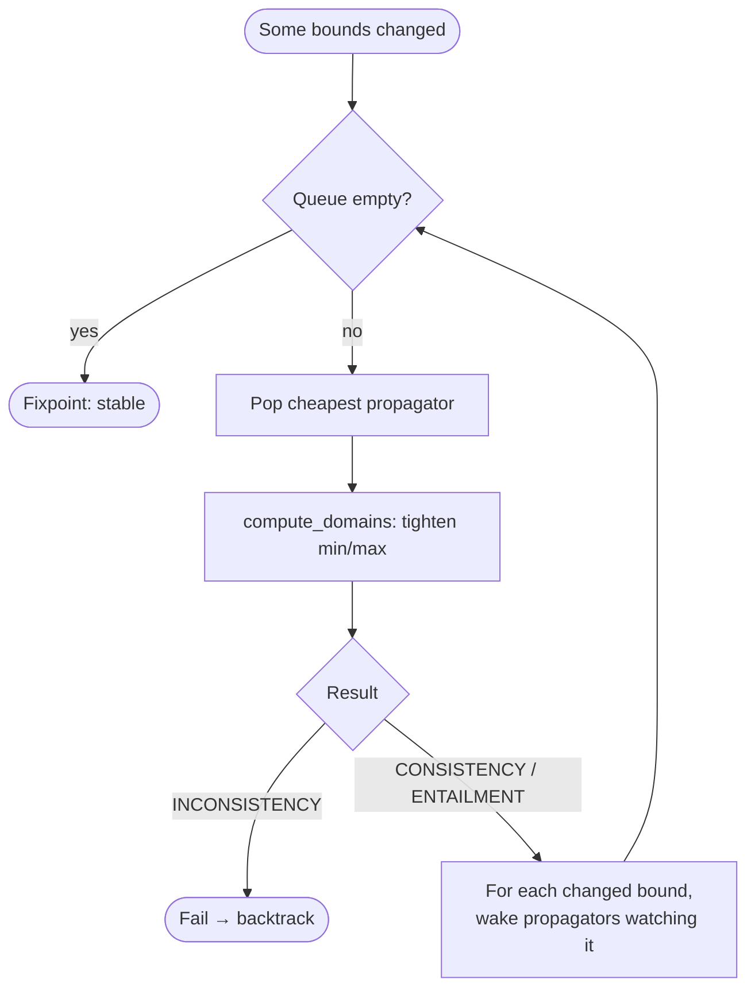
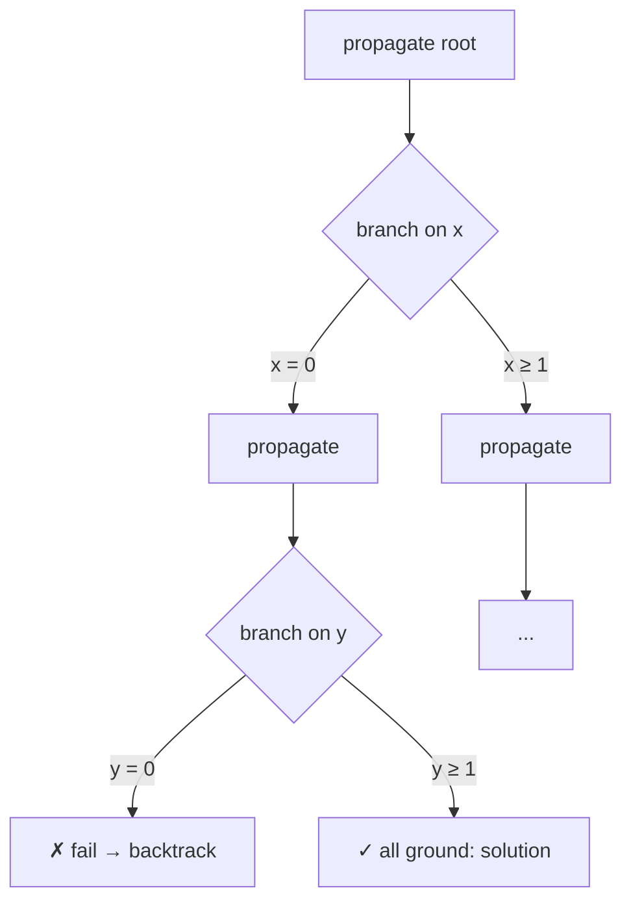
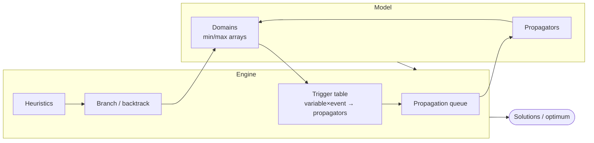

<!-- _class: lead -->

# Constraint Programming

## on Integers — a practical tour with NuCS

<br>

**Yan Georget** &nbsp;·&nbsp; 60 minutes

---

# What you'll get out of this hour

<div class="columns">

<div>

### <span class="pill">Part 1</span> History & theory

Where CP comes from, NP-completeness, what a CSP is.

### <span class="pill">Part 2</span> Real problems

Knapsack, TSP, job-shop — modeled in NuCS.

### <span class="pill">Part 3</span> Propagation

The reasoning engine, with diagrams.

</div>

<div>

### <span class="pill">Part 4</span> Search & heuristics

Backtracking, branching choices, branch-and-bound.

### <span class="pill">Part 5</span> Inside NuCS

How a fast solver is actually built.

</div>

</div>

<div class="takeaway">No prior CP knowledge assumed. We stay on <strong>integer variables</strong> throughout, and use <strong>NuCS</strong> for concrete code.</div>

---

<!-- _class: lead part1 -->

# Part 1

## History & theory

---

<!-- _class: part1 -->

# A short history of CP



<div class="takeaway">CP grew out of the idea: <strong>state the constraints, let the machine search</strong>. Forty years of making that search smart.</div>

---

<!-- _class: part1 -->

# Why we need CP: NP-completeness

A problem is in **NP** if a candidate solution can be *checked* in polynomial time.
A problem is **NP-hard** if every NP problem reduces to it. **NP-complete** = NP ∩ NP-hard.

Classic NP-complete problems you've already met:

- **SAT** — is this Boolean formula satisfiable?
- **Graph coloring** — can this graph be $k$-colored?
- **Hamiltonian cycle** — a tour visiting every node once?
- **Bin packing**, **subset sum**, **scheduling with precedences**, …

<div class="takeaway">No known polynomial algorithm — yet we need answers every day. CP is one principled way to attack them.</div>

---

<!-- _class: part1 -->

# The naive approach blows up fast

8-queens — place 8 queens on a board, none attacking another.

<div class="columns-2-1">
<div>

| Encoding                                  |                           Search space |
|-------------------------------------------|---------------------------------------:|
| Naive: pick any 8 squares                 | $\binom{64}{8} \approx 4.4 \cdot 10^9$ |
| One queen per column                      |           $8^8 \approx 1.7 \cdot 10^7$ |
| Permutations (one per column **and** row) |                         $8! = 40\,320$ |
| **A good CP model**                       |                **~100 nodes explored** |

</div>
<div>



</div>

</div>

<div class="takeaway">The art is <strong>encoding</strong> the problem so the solver can prune aggressively — not brute force.</div>

---

<!-- _class: part1 -->

# A CP problem in one breath

A **Constraint Satisfaction Problem (CSP)** is a triple $\langle X, D, C \rangle$:

- $X = \{x_1, \dots, x_n\}$ — **variables**
- $D = \{D_1, \dots, D_n\}$ — a **domain** per variable (here: finite sets of integers)
- $C = \{c_1, \dots, c_m\}$ — **constraints**, each restricting a subset of variables

A **solution** assigns each $x_i$ a value $v_i \in D_i$ so that every $c \in C$ holds.

<div class="takeaway">Add an objective to <strong>minimize</strong>/<strong>maximize</strong> and it becomes a <strong>COP</strong> (Constraint Optimization Problem).</div>

---

<!-- _class: part1 -->

# Where CP sits among solvers

| Paradigm | Variables            | Sweet spot                               |
|----------|----------------------|------------------------------------------|
| **SAT**  | Boolean              | Huge formulas, conflict learning         |
| **MIP**  | Continuous + integer | Linear models, strong LP relaxation      |
| **SMT**  | Boolean + theories   | Verification, symbolic execution         |
| **CP**   | Integer, finite      | **Structured, non-linear** combinatorics |

<br>

CP shines with **global constraints**: `all_different`, `circuit`, `cumulative`, `element`, `table`, …
— each one a reusable chunk of combinatorial reasoning.

---

<!-- _class: part1 -->

# Teaser: N-Queens in NuCS


```python
from nucs.problems.problem import Problem
from nucs.propagators.propagators import ALG_ALLDIFFERENT
from nucs.solvers.backtrack_solver import BacktrackSolver


class QueensProblem(Problem):
    def __init__(self, n: int):
        super().__init__([(0, n - 1)] * n)  # n vars, domain 0..n-1
        self.add_propagator(ALG_ALLDIFFERENT, range(n))  # columns
        self.add_propagator(ALG_ALLDIFFERENT, range(n), range(n))  # diagonal ↘
        self.add_propagator(ALG_ALLDIFFERENT, range(n), range(0, -n, -1))  # diagonal ↙


print(next(BacktrackSolver(QueensProblem(8)).solve()))
```


<div class="takeaway">Three constraints. The diagonals reuse <code>all_different</code> with a per-variable <strong>offset</strong> — no extra variables.</div>

---

<!-- _class: lead part2 -->

# Part 2

## Real problems, modeled in NuCS

---

<!-- _class: part2 -->

# The modeling recipe


The skill is in **B** and **C**: a good choice of variables makes the constraints natural and the propagation strong.

We'll see this three times: **knapsack**, **TSP**, **job-shop**.

---

<!-- _class: part2 -->

# Problem 1 — Knapsack

> Items with **weight** and **volume**; a bag of fixed **capacity**. Pick a subset that fits and **maximizes total weight**.

<div class="columns">

<div>

**Model:**

- one **0/1 variable** $x_i$ per item.
- $\sum_i \text{volume}_i\,x_i \le \text{capacity}$.
- maximize $\sum_i \text{weight}_i\,x_i$.

</div>

<div>



</div>

</div>

---

<!-- _class: part2 -->

# Knapsack in NuCS

```python
class KnapsackProblem(Problem):
    def __init__(self, dataset):
        n = len(weights)
        super().__init__([(0, 1)] * n + [(0, sum(weights))])  # x_i ∈ {0,1}, + total
        # sum_i volume_i · x_i ≤ capacity
        self.add_propagator(ALG_LINEAR_LEQ_C, range(n), [*volumes, capacity])
        # sum_i weight_i · x_i = total
        self.add_propagator(ALG_LINEAR_EQ_C, range(n + 1), [*weights, -1, 0])


solver.maximize(problem.weight)
```

<div class="takeaway">0/1 variables + two linear constraints. The objective variable <code>total</code> is <strong>part of the model</strong> — that's what makes optimization prune.</div>

---

<!-- _class: part2 -->

# Problem 2 — Travelling Salesman

> $n$ cities, cost $c_{ij}$ to go from $i$ to $j$. Find a tour visiting each city once, of **minimum total cost**.

<div class="columns">

<div>

**Successor model** — the key trick:

- $\text{succ}_i$ = the city right after $i$.
- **`circuit`** forces *one* Hamiltonian cycle — rules out **sub-tours**.
- $\text{cost}_i = c_{i,\,\text{succ}_i}$ via **`element`** (index a row by a variable).

</div>

<div>


</div>

</div>

<div class="takeaway">"No sub-tours" and "indexing by a variable" are exactly the kind of reasoning CP packages as <strong>global constraints</strong>.</div>

---

<!-- _class: part2 -->

# TSP in NuCS

```python
class TSPProblem(CircuitProblem):
    def __init__(self, costs):
        n = len(costs)
        super().__init__(n)  # succ/pred vars + circuit + no-sub-cycle
        self.succ_costs = self.add_variables(...)  # one cost var per city
        self.total_cost = self.add_variable(...)
        for i in range(n):
            # cost_i = costs[i][succ_i]   ← element: index a row by a variable
            self.add_propagator(ALG_ELEMENT_EQ, [i, self.succ_costs + i], costs[i])
        # total_cost = sum of per-city costs
        self.add_propagator(ALG_SUM_EQ,
                            list(range(self.succ_costs, self.succ_costs + n)) + [self.total_cost])


solver.minimize(problem.total_cost)
```

<div class="takeaway">NuCS also keeps a redundant <strong>predecessor</strong> model — same tour seen from both ends doubles the propagation.</div>

---

<!-- _class: part2 -->

# Problem 3 — Job-shop scheduling

> $n$ jobs, $m$ machines. Each job is a chain of operations; each runs on a given machine for a fixed time. A machine
> does **one operation at a time**. Minimize the **makespan** (finish time of the last operation).

**Variables:** one **start time** per operation.

<div class="columns-1-2">

<div>

- **Precedence**: op $k$ before $k{+}1$ → a linear inequality.
- **Resource**: one **`disjunctive`** per machine — no overlap.
- **Makespan** = max of the job completions.

</div>

<div>



</div>

</div>

---

<!-- _class: part2 -->

# Job-shop in NuCS

```python
class JobShopProblem(Problem):
    def __init__(self, jobs):
        ...  # one start var per operation
        for j in range(self.job_nb):
            for k in range(self.machine_nb - 1):  # job precedence
                self.add_propagator(ALG_LINEAR_LEQ_C,
                                    [self.start(j, k), self.start(j, k + 1)], [1, -1, -durations[j][k]])
        # makespan = max of completion times
        self.add_propagator(ALG_MAX_EQ, completions + [self.makespan])
        for machine in range(self.machine_nb):  # one resource constraint per machine
            self.add_propagator(ALG_DISJUNCTIVE, machine_starts, machine_durations)
```

<div class="takeaway">The <code>disjunctive</code> propagator does serious work: overload checking, <strong>edge-finding</strong>, detectable precedences. When demands aren't unit, the same idea generalizes to <strong>cumulative</strong> (a resource of capacity > 1).</div>

---

<!-- _class: part2 -->

# Lessons from the three models

1. **Variable choice is the lever** — 0/1 for knapsack, successors for TSP, start-times for scheduling.
2. **Few high-level constraints** beat many primitive ones (`circuit`, `disjunctive`, linear).
3. **The objective variable lives in the model** — propagation tightens it, branch-and-bound exploits it.
4. **Redundant constraints** (TSP predecessors, scheduling cumulative) strengthen reasoning for free.

<div class="takeaway">A CP model is mostly <strong>declarative</strong>: <em>what</em> must hold, not <em>how</em> to search.</div>

---

<!-- _class: lead part3 -->

# Part 3

## Propagation — the reasoning engine

---

<!-- _class: part3 -->

# Two engines, one loop

Solving a CSP interleaves:

1. **Propagation** — each constraint removes values that *cannot* be in any solution. Repeat to a fixpoint.
2. **Search** — when propagation stalls, **branch** (guess); on failure, **backtrack**.

<div class="columns">

<div>

**Propagation alone**
rarely finishes a problem.

</div>

<div>

**Search alone**
explodes exponentially.

</div>

</div>

<div class="takeaway">Together they're powerful: propagation shrinks the tree that search must explore.</div>

---

<!-- _class: part3 -->

# Domains as intervals (bound consistency)

NuCS represents each domain as an **interval** $[\min, \max]$ — two integers, not a full set.

```python
super().__init__([(0, n - 1)] * n)  # n domains, each = interval [0, n-1]
```

- **Cheap:** 2 ints per variable, mutated in place.
- **Ground** when $\min = \max$.
- **Trade-off:** no "holes" inside an interval (that's *arc* consistency) — but far faster per call.

<div class="takeaway"><strong>Bound consistency</strong> + strong global constraints is the modern sweet spot, and what NuCS uses.</div>

---

<!-- _class: part3 -->

# Propagation by example: `x + y = 10`

Domains: $x \in [0, 8]$, &nbsp; $y \in [3, 7]$.

| Step       | Reasoning                                      | New domains             |
|------------|------------------------------------------------|-------------------------|
| start      | —                                              | $x\in[0,8],\ y\in[3,7]$ |
| filter $x$ | $x = 10 - y$, so $x \ge 10-7$ and $x \le 10-3$ | $x \in [3, 7]$          |
| filter $y$ | $y = 10 - x$, so $y \ge 10-7$ and $y \le 10-3$ | $y \in [3, 7]$          |

Each constraint pushes the **bounds** inward using the others' bounds. No guessing yet.

<div class="takeaway">A propagator is just: <em>read min/max, tighten min/max, report what changed</em>.</div>

---

<!-- _class: part3 -->

# The propagation fixpoint



<div class="takeaway">Only re-wake constraints whose variables actually changed. Terminates because domains are <strong>finite</strong> and only <strong>shrink</strong>.</div>

---

<!-- _class: part3 -->

# Global constraints: more than sugar

`all_different(x_1, …, x_n)` is *logically* a clique of $\binom{n}{2}$ pairwise `≠`.

<div class="columns">

<div>

**Clique of `≠`**
propagates **weakly** — each `≠` only fires once a side is ground.

</div>

<div>

**Dedicated `all_different`**
reasons over the **whole set**: Hall intervals (BC), bipartite matching (Régin's AC).

</div>

</div>

> Example: if $\{x_1,x_2,x_3\}$ all have domain $[1,3]$, they *use up* $\{1,2,3\}$ — so any other variable can drop
> those three values. Pairwise `≠` can't see this.

<div class="takeaway">Same logical meaning, <strong>much more pruning per call</strong> → dramatically smaller search tree.</div>

---

<!-- _class: lead part4 -->

# Part 4

## Search & heuristics

---

<!-- _class: part4 -->

# Backtracking search

When propagation stalls, pick a variable, split its domain, recurse — undo on failure.



<div class="takeaway">A <strong>trail</strong> stores the bounds before each branch, so backtracking is just restoring two integers per touched variable.</div>

---

<!-- _class: part4 -->

# Search in pseudocode

```python
def search(state):
    propagate(state)  # fixpoint
    if inconsistent: return FAIL
    if all variables ground: yield SOLUTION; return
    x = choose_variable(state)  # variable heuristic
    for v in choose_values(D_x):  # value heuristic
        push(state);
        assign(x, v)  # record on the trail
        search(state)
        pop(state)  # backtrack: restore bounds
```

<div class="takeaway">Two heuristics decide the <em>shape</em> of the tree — and the shape is everything.</div>

---

<!-- _class: part4 -->

# Heuristics: choosing where to branch

<div class="columns">

<div>

### Variable heuristics

- **first-fail**: smallest domain first → hit dead-ends early.
- most-constrained / max-degree.
- impact- / activity-based.

</div>

<div>

### Value heuristics

- smallest value first.
- value that *least* constrains others.
- problem-specific (e.g. "schedule earliest").

</div>

</div>

> NuCS ships both, and lets you **stage** them: e.g. job-shop branches on a *critical machine* first, scheduling each
> task as early as possible — orders of magnitude fewer nodes than a generic order.

<div class="takeaway">Good model + good heuristic = the whole ball game.</div>

---

<!-- _class: part4 -->

# Optimization = repeated satisfaction

To minimize an objective variable $z$:

```python
best = +∞
while True:
    add
    temporary
    constraint
    z < best
    sol = solve()  # find one solution
    if sol is None: return best  # proven optimal
    best = sol[z]  # tighten, keep going
```

Each solution adds a tighter bound on $z$, which **propagates** and prunes the rest of the tree.

This is **branch-and-bound**. &nbsp; In NuCS: `solver.minimize(var)` / `solver.maximize(var)`.

<div class="takeaway">Because <code>z</code> is a normal variable, the bound <code>z &lt; best</code> is just another constraint the engine already knows how to exploit.</div>

---

<!-- _class: lead part5 -->

# Part 5

## Inside NuCS — how a fast solver is built

---

<!-- _class: part5 -->

# Anatomy of the solver



<div class="takeaway">Everything is a <strong>NumPy array</strong> — domains, propagator tables, the queue — so the hot loop can be <strong>JIT-compiled with Numba</strong>.</div>

---

<!-- _class: part5 -->

# A propagator is three functions

Registered once, identified by an integer `ALG_*`:

```python
ALG_X = register_propagator(get_triggers_x, get_complexity_x, compute_domains_x)
```

- `get_triggers_x(...) -> EVENT_MASK` — which events of *this* variable should re-wake me? (`MIN`, `MAX`, `GROUND`)
- `get_complexity_x(...) -> int` — used to order the queue (cheap propagators first).
- `compute_domains_x(domains, parameters) -> status` — the filtering itself; returns `INCONSISTENCY` / `CONSISTENCY` /
  `ENTAILMENT`.

<div class="takeaway"><strong>Entailment</strong> = "this constraint can never be violated again" → skip it for the rest of the subtree.</div>

---

<!-- _class: part5 -->

# A real propagator: `x ≤ y + c`

```python
@njit(cache=True, fastmath=True)
def compute_domains_leq_c(domains, parameters):
    x, y = domains[0], domains[1]
    c = parameters[0]
    if x[MAX] <= y[MIN] + c:           # already true for every value → entailed
        return PROP_ENTAILMENT
    x[MAX] = min(x[MAX], y[MAX] + c)   # x can be at most y's max (+ c)
    if x[MIN] > x[MAX]: return PROP_INCONSISTENCY
    y[MIN] = max(y[MIN], x[MIN] - c)   # y must be at least x's min (− c)
    if y[MIN] > y[MAX]: return PROP_INCONSISTENCY
    return PROP_CONSISTENCY
```

<div class="takeaway">Pure mutation of <code>min</code>/<code>max</code>. No allocation, no Python objects, no branching on types — exactly what Numba compiles to tight machine code.</div>

---

<!-- _class: part5 -->

# Events & triggers — re-wake only what matters

```python
def get_triggers_leq_c(n, variable, parameters):
    if variable == 0:        # x ≤ y + c: only x's MIN can tighten y
        return EVENT_MASK_MIN
    return EVENT_MASK_MAX     # only y's MAX can tighten x
```

When `compute_domains` moves a bound, the engine looks up `triggers[variable, event]` and wakes exactly those
propagators.

<div class="takeaway"><strong>Wakeup discipline is half the performance story</strong> — never recompute a constraint nothing touched.</div>

---

<!-- _class: part5 -->

# Idempotency: returning at a fixpoint

A subtle but important contract: when a propagator returns, calling it again on the same domains should change **nothing**.

- The engine treats *"queue empty"* as *"global fixpoint reached"* — valid only if each propagator is **idempotent on
  return**.
- Some rules aren't naturally idempotent (e.g. scheduling edge-finding): one pass leaves more pruning on the table.
- → such propagators run an **internal loop** to their own fixpoint before returning.

<div class="takeaway">Cheaper than letting the global queue re-schedule the propagator over and over.</div>

---

<!-- _class: part5 -->

# Why this is hard to make fast in Python

- Per-variable work is **tight integer math** — compares, mins, maxes.
- A solve can issue **millions** of propagator calls per second.
- Plain CPython interpreter overhead would dominate by 50–100×.

**NuCS strategy:**

1. **Numba JIT** every hot function — `@njit(cache=True, fastmath=True)`.
2. **No Python objects** in jitted code — only typed NumPy arrays and ints.
3. **Mutate in place**, never reallocate.
4. **Function pointers** so propagators can be dispatched from inside jitted code.
5. **Multiprocessing** over `problem.split(...)` for embarrassingly parallel search.

---

<!-- _class: part5 -->

# What you give up vs. what you get

<div class="columns">

<div>

### ⚠️ You give up

- Sparse domains with **holes** (NuCS is bound-consistent).
- Arbitrary Python in hot paths.
- Some expressiveness — model with the propagators that exist (or write one).

</div>

<div>

### ✅ You get

- A **pure-Python** package competitive with C++ solvers on many benchmarks.
- A **small, readable** codebase you can extend in an afternoon.
- Warm-cache (Numba) startup + trivial multiprocessing.

</div>

</div>

---

<!-- _class: part5 -->

# When should you reach for CP?

<div class="columns">

<div>

### ✅ Good fit

- **Scheduling**, **rostering**, configuration, routing, puzzles.
- Rich logical structure — `all_different`, precedences, packing.
- Integer objective, highly constrained model.

</div>

<div>

### ⚠️ Less good fit

- Pure linear/continuous → **MIP**.
- Boolean-heavy, little structure → **SAT**.
- Very-large-scale industrial OR → **CP-SAT** (OR-Tools) blends CP + SAT.

</div>

</div>

---

# What we covered

1. **History & theory** — CP states constraints and searches smartly; NP-completeness is why.
2. **Modeling** — TSP, knapsack, job-shop: the *variable choice* is the lever.
3. **Propagation** — bound consistency to a fixpoint; global constraints carry the reasoning.
4. **Search** — backtracking + heuristics + branch-and-bound.
5. **NuCS** — a propagation queue + a backtracking loop, made fast with **Numba**.

---

# Resources

- 📚 **CSPLIB** — [csplib.org](https://www.csplib.org) — problem catalogue (Golomb #6, knapsack #133).
- 📕 **Handbook of Constraint Programming** — Rossi, van Beek, Walsh (Elsevier, 2006).
- 🧰 **MiniZinc Handbook** — the best on-ramp to modeling.
- ⚙️ **NuCS** — [github.com/yangeorget/nucs](https://github.com/yangeorget/nucs)
- 🏭 **OR-Tools CP-SAT** — Google's industrial-grade solver.

---

<!-- _class: lead -->

# Questions?

<br>

*Bonus demo, if there's time:*
&nbsp;&nbsp;live-run Queens, knapsack, job-shop (mt06), TSP-15.
